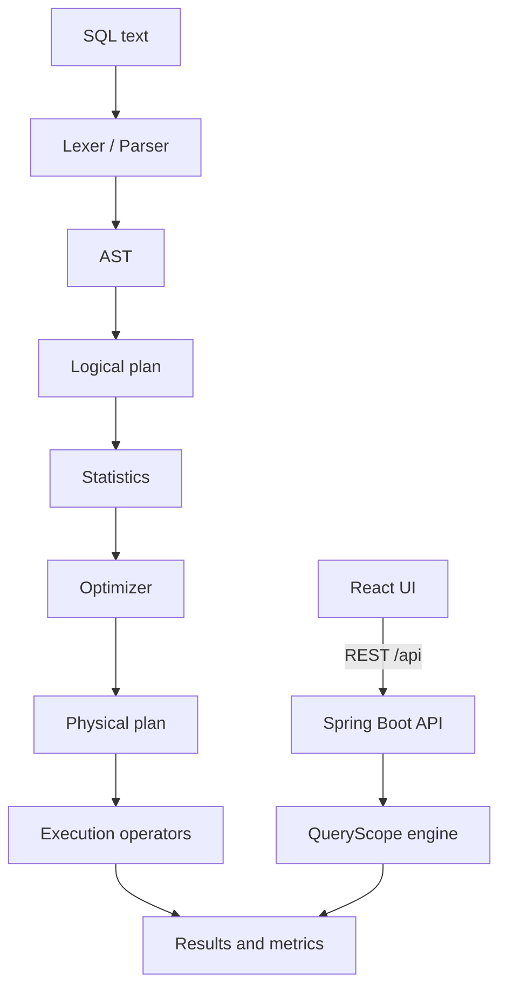

# QueryScope

> An experimental relational database engine with an interactive query-plan visualizer.

QueryScope is a database-engineering project, not a CRUD application. The long-term goal is to build a small relational database engine in Java and a React interface that makes query execution and planning visible.

QueryScope demonstrates how a SQL statement becomes an executable plan. It implements a small relational engine from scratch and pairs it with a React workspace that exposes the AST, physical operators, optimizer decisions, and measured execution metrics.

This is an educational and experimental project, not a production database, PostgreSQL replacement, or enterprise data platform. The demo database is intentionally in-memory: restarting the backend resets runtime data and indexes.

## Features

- SQL lexer/parser and immutable AST generation
- In-memory relational execution with table scans, filters, and projections
- Nested-loop and hash joins
- `GROUP BY`, `COUNT`, `SUM`, and `AVG`
- Order-4 B+ tree indexes and index scans
- Execution-plan visualization with operator metrics
- Table statistics, cardinality estimation, and cost-based optimization
- Deterministic benchmark scenarios using operation counts instead of wall-clock timing
- Interactive React workspace with Docs, Help, Settings, and query history

## Architecture



The frontend and backend are separate in development and use same-origin `/api` requests in the production container. A production frontend can also set `VITE_API_BASE_URL` to an explicitly hosted backend origin.

## How the engine works

1. The parser turns supported SQL into an AST, a structured representation of what the user wrote.
2. The planner turns that AST into a logical execution shape such as projection → filter → scan.
3. Statistics describe table sizes, distinct values, ranges, and indexes.
4. The optimizer estimates eligible alternatives and chooses a physical plan in `AUTO` mode. `MANUAL` mode preserves requested strategies.
5. Operators execute the plan: table scans inspect rows directly, index scans use B+ tree lookups, joins combine rows, and aggregation groups them.
6. The workspace displays rows, measured work, the plan tree, and optimizer reasoning.
7. The deterministic benchmark lab runs equivalent strategies over isolated generated data and compares operation counts rather than timing.

## Quick start

### Docker Compose

```bash
git clone <repository-url>
cd queryscope
docker compose up --build
```

Open [http://localhost:3000](http://localhost:3000). The backend health endpoint is available at [http://localhost:8080/api/health](http://localhost:8080/api/health).

Stop the services with:

```bash
docker compose down
```

The Compose frontend proxies `/api` to the backend container, so the browser never attempts to resolve the internal hostname `backend`. Data remains in memory and resets when the backend restarts.

### Manual development

Terminal 1:

```bash
cd backend

# Windows PowerShell
.\mvnw.cmd spring-boot:run

# macOS/Linux
./mvnw spring-boot:run
```

Terminal 2:

```bash
cd frontend
npm install
npm start
```

Visit [http://localhost:3000](http://localhost:3000). Vite proxies `/api` to `http://localhost:8080` during development. The backend port defaults to `8080` and can be changed with `PORT`; production CORS origins can be supplied with `QUERYSCOPE_ALLOWED_ORIGINS`.

## Testing and builds

Backend:

```bash
cd backend

# Windows PowerShell
.\mvnw.cmd test
.\mvnw.cmd package -DskipTests

# macOS/Linux
./mvnw test
./mvnw package -DskipTests
```

Frontend:

```bash
cd frontend
npm ci
npm test -- --run
npm run build
```

GitHub Actions runs these checks on every push and pull request without requiring manually running either application.

## Production preparation

- `backend/Dockerfile` builds the Spring Boot JAR in a Maven stage and runs it as a non-root user on a JRE image.
- `frontend/Dockerfile` builds Vite assets with Node and serves them from nginx.
- `frontend/nginx.conf` provides SPA fallback for `/workspace`, `/docs`, and `/benchmarks`, proxies `/api/` to the backend service, and applies immutable caching only to hashed assets.
- `frontend/.env.example` documents `VITE_API_BASE_URL`; blank keeps the recommended same-origin `/api` behavior.
- `PORT` and `QUERYSCOPE_ALLOWED_ORIGINS` configure the Spring Boot runtime without changing local defaults.

## Deterministic benchmark evidence

The verified `INDEX_EQUALITY` / `SMALL` scenario compares the same result over 1,000 expense rows: the table scan inspects 1,000 rows, while the index scan performs one lookup, examines two matching rows, and returns the same two rows. These are deterministic operation counts, not a production performance guarantee.

## Project structure

```text
queryscope/
├── backend/       # Java/Spring Boot HTTP API
├── frontend/      # React/TypeScript web interface
├── .gitignore
└── README.md
```

## Architecture

The frontend runs as a separate development server and calls the backend through `/api`. The backend has distinct controller, service, model, repository, and engine packages so the database implementation has a clear home. Parsing remains pure application logic: it turns SQL text into an immutable AST. The execution service then builds an execution plan and evaluates it against the in-memory database.

## Tech stack

- Backend: Java 17+, Spring Boot 3.5, Maven, JUnit 5
- Frontend: React, TypeScript, Vite, Vitest, Testing Library
- Ports: backend `8080`, frontend `3000`

No Firebase, Firestore, authentication, or external application database is used.

## Run locally

### Backend

From `backend/`:

```bash
# Windows PowerShell
.\mvnw.cmd test
.\mvnw.cmd spring-boot:run

# macOS/Linux
./mvnw test
./mvnw spring-boot:run
```

The API is available at `http://localhost:8080`.

### Frontend

From `frontend/`:

```bash
npm install
npm start
```

The web interface is available at `http://localhost:3000`. The Vite development proxy forwards `/api` requests to the backend at port 8080.

Frontend checks:

```bash
npm test
npm run build
```

## Frontend workspace

The frontend has three direct routes, all available after a browser refresh:

- `/workspace` — SQL editor, schema explorer, query history, AST, results, actual execution metrics, physical plan, optimizer details, and strategy comparison.
- `/docs` — supported SQL and architecture guide with copyable examples. `Use in Workspace` loads an example without running it.
- `/benchmarks` — deterministic performance lab for scan, join, and optimizer scenarios.

Workspace shortcuts:

- `Ctrl+Enter` on Windows/Linux or `Cmd+Enter` on macOS runs the query.
- `Ctrl/Cmd+Shift+Enter` parses the query without executing it.
- `Escape` closes an open Help or Settings dialog and the mobile navigation menu.

The Help and Settings controls are functional. Settings are stored locally in the browser and include density, optimizer details, execution metrics, automatic plan expansion, last-query restoration, and reset-to-defaults. Query history is also local under `queryscope.history`, keeps the 30 most recent queries, deduplicates consecutive entries, and supports Load, Run again, Remove, and Clear. Loading a query never runs it automatically.

The Schema Explorer supports expandable table details, row-count display when statistics are available, Refresh, Use table, and the existing Create index workflow. The application does not persist query data or schema mutations in the backend.

## Current capabilities

- `GET /api/health` returns `{ "status": "ok" }`.
- The frontend reports whether the backend health check is reachable.
- Lexical analysis with case-insensitive `SELECT`, `CREATE INDEX`, `FROM`, `JOIN`, `ON`, `WHERE`, `GROUP BY`, `COUNT`, `SUM`, `AVG`, and boolean keywords.
- Parsing of `SELECT`, one-column `CREATE INDEX`, optional qualified columns and aggregate expressions, `FROM`, one equality-based inner `JOIN`, optional `WHERE`, optional `GROUP BY`, comparison expressions, integer/string/boolean literals, and optional trailing semicolons.
- Immutable AST generation for supported queries.
- `POST /api/query/parse` returns the parsed AST and uses HTTP 400 for invalid user SQL.
- The frontend displays successful parses as an expandable AST tree and shows parser/backend errors clearly.
- An in-memory, case-insensitive `users` and `expenses` demo schema is seeded at startup. Data resets when the backend restarts.
- `SELECT` execution supports wildcard or named projection, optional `WHERE` comparisons, and equality-based inner joins using either nested-loop or hash execution.
- `GROUP BY` supports one or more grouping columns with `COUNT(*)`, `COUNT(column)`, `SUM(integer_column)`, and `AVG(integer_column)`.
- Aggregation runs after `WHERE` and joins. Group keys preserve integer, string, and boolean value types; output groups retain deterministic first-seen input order.
- Qualified references such as `users.id` and `expenses.user_id` resolve across joined schemas. Ambiguous unqualified references return HTTP 400.
- `POST /api/query/execute` returns result columns, rows, row count, and `rowsScanned`/`rowsReturned` metrics. Unknown tables or columns and type mismatches return HTTP 400.
- Each execution response also contains an explicit plan tree with `PROJECTION`, `FILTER`, `AGGREGATE`, `NESTED_LOOP_JOIN`, `HASH_JOIN`, `TABLE_SCAN`, and `INDEX_SCAN` nodes, measured input/output rows, and operator details.
- Join strategy is selected explicitly per execution with `NESTED_LOOP` (the default) or `HASH`; QueryScope does not choose automatically. Hash joins build on the smaller input, breaking equal-size ties in favor of the left input.
- A hand-built order-4 B+ tree indexes integer and string columns. Indexes are populated from existing rows and maintained for later inserts. Exact and inclusive/exclusive range lookups return row positions, including duplicate keys.
- Scan strategy is selected explicitly per execution with `TABLE` (the default) or `INDEX`; QueryScope does not optimize or automatically choose an index. An index scan requires a matching single-column index and a `WHERE` equality/range predicate.
- `GET /api/schema` exposes tables, columns, and indexes. `POST /api/schema/indexes` accepts `{ "name": "idx_amount", "table": "expenses", "column": "amount" }` and creates an index.
- The cost-based optimizer runs in `AUTO` mode by default. It builds table/column/index statistics, estimates cardinalities, compares deterministic abstract costs for eligible scans and joins, and selects the lowest-cost candidate with stable tie-breaking.
- `MANUAL` mode preserves the requested `TABLE`/`INDEX` and `NESTED_LOOP`/`HASH` strategies. Every execution returns structured optimizer metadata with the original plan, optimized physical plan, applied rule IDs, decisions, and reasons.
- `GET /api/statistics` exposes the current row count, per-column distinct values and numeric min/max values, plus index distinct keys and indexed rows. Statistics are refreshed into one consistent snapshot for each optimization request.
- The deterministic performance lab compares real `TABLE_SCAN`/`INDEX_SCAN` and `NESTED_LOOP_JOIN`/`HASH_JOIN` operation counts on isolated benchmark databases. It reports actual work separately from optimizer estimates and never uses timing to decide correctness.
- The frontend can parse SQL to inspect its AST or run it to display result rows, execution metrics, and the generated plan.

## Execution plan architecture

The AST describes what the user wrote. The initial plan is the logical execution shape; the optimizer then rewrites eligible nodes into a physical plan that describes how QueryScope executes the statement:

```text
AST
 ↓
ExecutionPlanBuilder
 ↓
Initial logical plan
 ↓
Cost-based optimizer
 ↓
Physical ExecutionPlan
 ↓
ExecutionPlanExecutor
 ↓
QueryResult + executionPlan
```

The optimizer recursively optimizes child nodes, generates eligible table/index scan and nested-loop/hash join candidates, estimates rows, and chooses the lowest abstract cost. A table scan costs one unit per input row; an index scan costs lookup plus logarithmic traversal plus fetched rows; filters, projections, joins, and aggregates add fixed per-row work. These are educational work units, not wall-clock timings. Ties prefer `INDEX_SCAN` over `TABLE_SCAN` and `HASH_JOIN` over `NESTED_LOOP_JOIN`.

Cardinality uses equality selectivity `1 / distinctValues`, a uniform-distribution assumption between numeric min/max for range predicates, and the join approximation `(leftRows × rightRows) / max(leftDistinct, rightDistinct)`. Missing statistics use centralized fallback selectivities of `0.25` for filters and `0.10` for joins. This is an educational/experimental cost model, not a production-grade optimizer; estimated rows and cost are separate from actual execution metrics such as rows scanned, comparisons, and hash lookups.

For an `AUTO` query with a matching index, the physical plan is:

```text
Projection (columns: description, amount)
└── IndexScan (idx_amount, predicate: amount = 300)
```

Without a matching index, the physical plan remains:

```text
Projection (columns: name, age)
└── Filter (condition: age > 18)
    └── TableScan (table: users)
```

For a join, the plan branches at the join node:

```text
Projection (columns: users.name, expenses.amount)
└── NestedLoopJoin (condition: users.id = expenses.user_id)
    ├── TableScan (table: users)
    └── TableScan (table: expenses)
```

The same join can be executed as a hash join by sending `joinStrategy: "HASH"`. Its plan reports the build/probe side, build and probe row counts, rows inserted, hash lookups, bucket count, matches, and output rows. Nested-loop joins report left/right rows, comparisons, matches, and output rows. Both operators share the same schema resolution, equality validation, and row assembly logic.

For a left input of `N` rows and a right input of `M` rows, nested-loop execution performs `N × M` comparisons. Hash execution builds a hash table on the smaller input and probes the larger input, with one lookup per probe row plus hash-bucket matching work. This is an execution-strategy comparison fixture, not an optimizer: users explicitly choose the strategy and results are compared as unordered row sets in the frontend.

`SELECT * FROM users` uses only `TableScan`, while named projections add a `Projection` node. A selected index scan replaces the table/filter pair and reports the index name, lookup count, leaf entries visited, rows examined, and rows returned. Joined wildcard results expose qualified column names such as `users.id` and `expenses.id`. Plan metadata reports only measured row counts; nested-loop joins additionally report left/right rows, comparisons, matches, and output rows. Aggregate nodes additionally report grouping expressions, aggregate functions, input rows, groups produced, and output rows. `COUNT` and `SUM` use the existing integer-compatible long-valued representation; `AVG` returns `DOUBLE` without truncation. With no input rows, `COUNT` returns one row containing zero, grouped aggregates return no groups, and ungrouped `SUM`/`AVG` return a clear execution error because the current row model has no NULL value.

Example SQL:

```sql
SELECT name, age
FROM users
WHERE age > 18;
```

Example join:

```sql
SELECT users.name, expenses.amount
FROM users
JOIN expenses
ON users.id = expenses.user_id;
```

Example aggregation:

```sql
SELECT user_id, SUM(amount)
FROM expenses
WHERE amount > 50
GROUP BY user_id;
```

The plan for this query is `Projection → Aggregate → Filter → TableScan`. For a joined aggregate, the aggregate sits above the selected nested-loop or hash join. Every selected non-aggregate column must appear in `GROUP BY`; QueryScope does not choose arbitrary values.

Example optimizer response fragment:

```json
{
  "optimization": {
    "mode": "AUTO",
    "rulesApplied": [
      {
        "rule": "MATCHING_INDEX",
        "decision": "USE_INDEX_SCAN",
        "reason": "Index idx_amount exists on expenses.amount and supports predicate amount = 300."
      }
    ],
    "candidates": [
      { "planType": "TABLE_SCAN", "estimatedRows": 2, "estimatedCost": 2.5 },
      { "planType": "INDEX_SCAN", "estimatedRows": 1, "estimatedCost": 2.25 }
    ],
    "selectedPlan": "INDEX_SCAN",
    "estimatedRows": 1,
    "estimatedCost": 2.25,
    "selectionReason": "Selected INDEX_SCAN because its estimated cost is 2.25 versus TABLE_SCAN at 2.50."
  }
}
```

Example index workflow:

```http
POST /api/schema/indexes
Content-Type: application/json

{ "name": "idx_expenses_amount", "table": "expenses", "column": "amount" }
```

```json
{ "sql": "SELECT description FROM expenses WHERE amount > 50", "scanStrategy": "INDEX" }
```

Example AST response:

```json
{
  "type": "SELECT",
  "columns": [
    { "type": "COLUMN", "name": "name" },
    { "type": "COLUMN", "name": "age" }
  ],
  "from": { "type": "TABLE", "name": "users" },
  "where": {
    "type": "COMPARISON",
    "operator": "GREATER_THAN",
    "left": { "type": "COLUMN", "name": "age" },
    "right": { "type": "NUMBER", "value": 18 }
  }
}
```

## API

- `POST /api/query/parse` accepts `{ "sql": "..." }` and returns an AST for supported SQL.
- `POST /api/query/execute` accepts `{ "sql": "...", "mode": "AUTO" | "MANUAL", "joinStrategy": "NESTED_LOOP" | "HASH", "scanStrategy": "TABLE" | "INDEX" }` and returns result data, the optimized `executionPlan`, and `optimization` metadata. `mode` defaults to `AUTO`; strategy fields are case-insensitive.
- The same settings can be supplied under an `execution` object, for example `{ "sql": "...", "execution": { "mode": "MANUAL", "joinStrategy": "HASH", "scanStrategy": "TABLE" } }`. In `AUTO`, explicit strategy fields are ignored; in `MANUAL`, they are honored.
- `optimization.rulesApplied` contains structured `{ "rule", "decision", "reason" }` entries. It can include `MATCHING_INDEX`, `NO_MATCHING_INDEX`, `EQUALITY_JOIN`, `HASH_JOIN_FALLBACK`, or `MANUAL_STRATEGIES`.
- `optimization.candidates` lists candidate physical plan types with estimated rows and deterministic abstract costs. `selectedPlan`, `estimatedRows`, `estimatedCost`, and `selectionReason` explain the choice. Manual mode leaves candidates empty and preserves the requested physical strategy.
- `GET /api/statistics` returns current table row counts, column distinct values and numeric min/max values, and index distinct-key/indexed-row counts.
- `GET /api/benchmarks/scenarios` returns the safe predefined benchmark scenarios and dataset sizes. `POST /api/benchmarks/run` accepts `{ "scenario": "INDEX_EQUALITY", "datasetSize": "SMALL" }` and returns equivalent-result status, operation metrics, optimizer candidates when applicable, estimation error, and a generated explanation.
- `GET /api/schema` returns `{ "tables": [{ "name": "expenses", "columns": [{ "name": "amount", "type": "INTEGER" }], "indexes": [{ "name": "idx_amount", "column": "amount" }] }] }`.
- `POST /api/schema/indexes` accepts `{ "name": "idx_amount", "table": "expenses", "column": "amount" }` and returns the updated schema. Indexes currently support one INTEGER or STRING column per index.
- Aggregate queries use the same execute endpoint and return deterministic result column names such as `SUM(amount)` and `AVG(amount)`. Aggregate plan details include `groupBy`, `functions`, `groups`, `inputRows`, and `outputRows`.
- On non-join queries, `joinStrategy` has no effect. In `AUTO`, scan selection is cost-based; in `MANUAL`, table scans, filters, and projections honor the selected scan strategy.
- The execute response also includes `executionPlan`, a recursive tree whose nodes expose `type`, operator-specific `details`, `inputRows`, `outputRows`, and `children`.
- Invalid SQL returns HTTP 400 with `{ "error": "..." }`.

## Deterministic performance lab

Benchmark datasets are isolated from the seeded application database. `SMALL`, `MEDIUM`, and `LARGE` contain respectively 100/1,000, 500/5,000, and 1,000/10,000 users/expenses. The large size is intentionally capped so nested-loop comparisons remain practical on a development machine. User IDs, expense ownership, and amounts are generated by fixed arithmetic; no uncontrolled randomness is used.

Available scenarios are `INDEX_EQUALITY`, `INDEX_RANGE_SELECTIVE`, `INDEX_RANGE_BROAD`, `JOIN_SMALL`, `JOIN_MEDIUM`, `JOIN_LARGE`, `OPTIMIZER_SCAN`, and `OPTIMIZER_JOIN`. Scan scenarios use `amount = 499`, `amount > 400`, or `amount > 10`; join scenarios use the real equality join between `users` and `expenses`. The benchmark runs both strategies over identical data, verifies equivalent logical results before comparing them, and reports rows scanned, index entries visited, comparisons, hash build/probe rows, lookups, matches, and output rows.

Operation counts are primary because they are deterministic. Wall-clock timing is deliberately omitted, so benchmark correctness does not depend on machine load. Optimizer estimated cost remains an abstract planning unit and is never compared directly with milliseconds. Estimation reports include absolute error and percentage error only when actual rows are nonzero. This lab validates the current in-memory engine; it is not a generic load-testing system or a production performance guarantee.

The current demo database supports schema inspection and index creation, but remains intentionally limited: table creation, row mutation, persistence, composite/unique/partial/expression indexes, and `DROP INDEX` are future work.

## Future work

1. ~~SQL lexer/parser~~
2. ~~AST~~
3. ~~In-memory tables~~
4. ~~Table scan/filter/projection~~
5. ~~Execution plans~~
6. ~~Joins~~
7. ~~GROUP BY and aggregates~~
8. ~~B+ tree indexes and index scans~~
9. ~~Rule-based query optimizer~~
10. ~~Table statistics, cardinality estimation, and cost-based optimization~~
11. ~~Deterministic benchmarking and performance analysis~~
12. Visualization

The current milestone intentionally omits `LEFT`, `RIGHT`, `FULL`, `CROSS`, and `NATURAL JOIN`, multiple join chains, `USING`, non-equality joins, subqueries, `HAVING`, `ORDER BY`, `LIMIT`, `MIN`, `MAX`, `DISTINCT`, window functions, `NULL` semantics, mutations, composite/unique/partial/expression indexes, `DROP INDEX`, persistence, and learned or calibrated cost estimates. Future optimizer work includes join reordering, predicate pushdown, richer statistics, and benchmark calibration.
